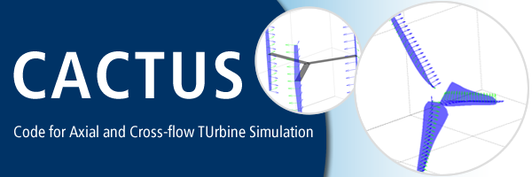

Copyright (c) 2013, Sandia Corporation.  Under the terms of Contract
DE-AC04-94AL85000 with Sandia Corporation, the U.S. Government retains
certain rights in this software. 

Building and installing
-----------------------
Also see `install.txt`

### Linux (Ubuntu or similar)
  * Install gfortran if not already installed: 
    * From a terminal `sudo apt-get update`
    * `sudo apt-get install gfortran`
  * Install LAPACK and BLAS:
	* `sudo apt-get install liblapack-dev`
	* `sudo apt-get install libblas-dev`
  * Inside this directory run `make`
  * `make install`

### Windows
  * Download and install MinGW (32-bit) and MSYS (http://mingw.org)
  * Open MinGW bash in this directory and execute `make`
  * Execute `make install` (Note: this assumes default MinGW path)

Usage
-----
These instructions are for running from a shell or command line. For automation with Python
see the "Python interface" section below. 

### Linux
  * cd into project directory
  * Run `cactus InputFileName.in`

### Windows (MinGW)
  * Open MinGW bash in project directory (where the `*.in` file is located)
  * Run `cactus InputFileName.in`
  
Python interface
----------------
An Python 2.7 interface is provided in the `cactus_py` directory. This package provides 
functions for reading CACTUS data and classes for running cases and batches of CACTUS cases 
to create performance curves.

### Installation
Inside the `cactus_py` directory, run `python setup.py install`. Note that Linux users may require superuser privileges to run this command. 

### Dependencies
  * Numpy
  * matplotlib
  * pandas
  
### Usage
#### Running a case
``` python
>>> from cactus import Case
>>> c = Case("TestHAWT_1")
>>> c.geomfile = "../TestGeom/TestHAWT.geom"
>>> c.run()
...
>>> c.calc_cp()
0.24711726000000006
```

#### Running and plotting a performance curve
See `Test/TestCase1/testhawt.py`.

3rd party libraries: LAPACK and BLAS
------------------------------------
Included in the `lib` directory. Prebuilt for MinGW-Win32.
http://icl.cs.utk.edu/lapack-for-windows/lapack/#libraries_mingw
